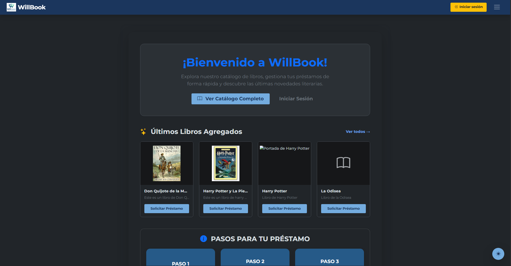
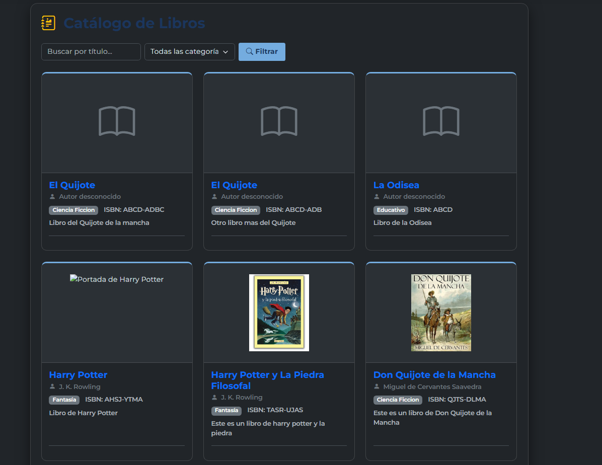

# WillBook - Sistema de Gestión de Biblioteca

WillBook es un sistema de Gestion para Bibliotecas. 
Consiste en un sistema web orientado a objetos para la administración integral de una biblioteca.

---

## 🚀 Tecnologías y Características Técnicas

El sistema cuenta con los siguientes requerimientos de arquitectura y desarrollo:

- **Backend:** Java 17, Servlets, JSP
- **Persistencia y Conexión:** Conexión a base de datos mediante **JDBC** y  **HikariCP**.
-  **Docker** y **Docker Compose**
- **CI/CD:**

---

## ⚙️ Requisitos Previos

Para ejecutar este proyecto de manera local, asegúrate de tener instalado:
- [Git](https://git-scm.com/)
- [Docker y Docker Compose](https://www.docker.com/)
- [Java JDK 17](https://adoptium.net/) 
- [Maven](https://maven.apache.org/)  
- Ejecutar el Script de la base de datos.

---

## 📐 Arquitectura y Patrones de Diseño

El sistema está diseñado bajo el patrón **Modelo-Vista-Controlador (MVC)**
- **Capa DAO (Data Access Object):** Encargada de separar la lógica de negocio de la lógica de acceso a datos, utilizando sentencias JDBC optimizadas.
- **Pool de Conexiones:** Implementación de **HikariCP** para la gestión eficiente y reutilización de conexiones concurrentes a MySQL.
- **Filtros de Seguridad (`AuthFilter`):** Intercepción de peticiones HTTP para control de sesiones y validación de accesos protegidos.
- **Manejo Centralizado de Excepciones:** Páginas de error personalizadas (`404`, `500`) para una mejor experiencia de usuario.

## 🗄️ Base de Datos
El sistema utiliza una base de datos relacional llamada `probiblioteca` que deberas ejecutarla con el script("probibliofin.sql"), la cual incluye entidades relacionadas para la gestión de:
- Usuarios y Roles
- Libros, Autores y Categorías
- Ejemplares y Préstamos
- Control de Multas

